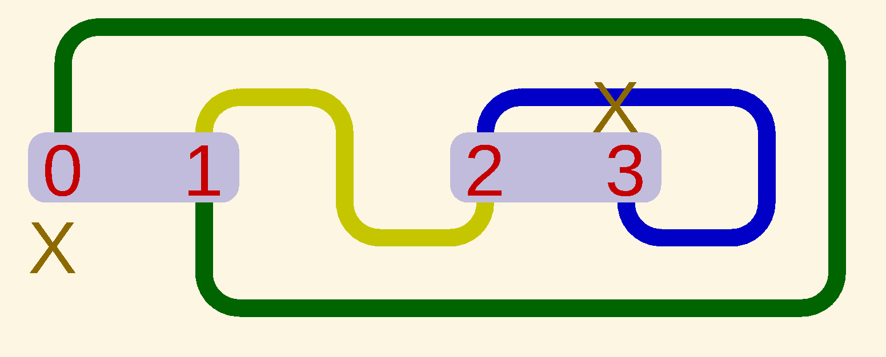

.. -*- mode: rst -*-

===========================
drawNodes - jiw - Jan 2020
===========================

Given ascii-graphics drawings of certain graphs, the ``drawNodes``
program produces files of OpenSCAD code to represent those graphs in a
line-art format.

Description
===========

The drawNodes package provides three Python programs for converting ASCII art
graphs into OpenSCAD files and PNG images with transparent backgrounds:

**drawNodes.py** - Original node graph renderer
  Renders basic node graphs with colored traces, ideal for simple diagrams.

**drawNodesLabeled.py** - Edge labeling with font styling
  Adds edge labels (lowercase letters) at both output and input positions,
  with bold/italic font styling, white halos for readability, node outlines,
  addition symbols, arrowheads, and complement circles on second outputs.

**drawProgression.py** - Progression/state-transition diagrams
  Specialized for showing state progressions with path tracing, downward
  arrows at inputs, and diagonal flow indicators for data flow visualization.

All three programs read ASCII graphics drawn with ``/ # \ _ X`` and space
characters, and write .scad files using OpenSCAD 2D graphics extruded to 3D.
Lines containing characters other than the drawing characters are treated as
text lines, and may be displayed or not in output, depending on command-line
options.

The rest of this file has the following sections:

 • `Software requirements`_
 • `Running the program`_
 • `Command-line Options`_
 • `Command-line Option Examples`_
 • `Automatic PNG Generation`_
 • `@Directives in Input Files`_

   - `Available @Directives`_
   - `Example Input File with @Directives`_

 • `Input file formats`_
 • `X-marks and Trace Colors`_

   - `Default Color Sequence`_
   - `Custom Color Sequences`_

 • `Font Styling in drawNodesLabeled.py`_
 • `Visual Elements in drawNodesLabeled.py`_
 • `Visual Elements in drawProgression.py`_
 • `Graph Parsing limitations`_
 • `How to make a .png output`_
 • `Automatic updates in OpenSCAD`_
 • `Automatically running drawNodes upon changes to your input file`_

Software requirements
=====================

 • Install python3 if your system lacks it
 • Install ``drawNodes.py``, ``drawNodesLabeled.py``, and ``drawProgression.py``
   as findable executable files, so that you can start them with commands like
   ``./drawNodes.py`` or ``python3 drawNodes.py``, etc
 • Install OpenSCAD per its instructions
 • Install ImageMagick (provides the ``convert`` command) for automatic PNG
   generation with transparent backgrounds
 • Install a picture viewer (such as gpicview, eog, xv, etc)

Running the program
====================
  
When you run the program to process an input file, it will write SCAD
code to a file or files, as named by *=filename* lines within the
input.  If the run is successful, you can then use openscad to display
results.  For example, if ``myfile`` is a proper input file and
contains a line ``=234`` to name an output file, you might say::

    drawNodes.py myfile
    openscad 234.scad &

[For two ways to speed up seeing the effects of changes to your input
file, see the sections `Automatic updates in OpenSCAD`_ and
`Automatically running drawNodes upon changes to your input file`_ below.]

Command-line Options
=====================

Command-line options take the form *value* or *opt=value* where *opt*
is in the set {*node, loci, text, file*} and where *value* is an input
file name or is a color name or number.

For the first three option codes, *value* should be a color name or
6-digit hex RGB number or 8-digit hex RGBA number.  Color examples
include::

  Red   BC0000   Green   00FF00   Blue   0000FF20

Defaults for *node, loci, text* are **0000FF20, Red, ''** (the latter
an empty string) to turn on **pale blue** *node* coloring; turn on
**Red** *loci* numbers; and turn off *text* display.  (Generally, use
an empty-string value **''** to turn off an option.  Eg, ``loci=''``
would suppress loci numbering.)

The default value for the *file* option is ``aTestSet``, which is a
file of test examples.  Note, a bare value is treated as a file name,
*ie*, is treated like file=value.  For example, ``drawNodes.py
myfile`` reads data from myfile with other options defaulted.

Command-line Option Examples
===============================

Two example command lines appear below.  The first reads from bigdata,
draws text lines in beige, loci numbers in green, and suppresses
nodes.  The second draws loci numbers in red on a pale green
background (since 00ff0010 is solid green, 0x00ff00, but at
alpha=0x10) with text lines suppressed::

  drawNodes.py bigdata text=beige loci=green node=''
  drawNodes.py bigdata loci=red node=00ff0010

Automatic PNG Generation
=========================

All three programs support automatic PNG generation with transparent backgrounds
using the ``png=`` command-line option::

  drawNodesLabeled.py myfile png=true

This automatically:

 • Generates .scad files from your ASCII diagrams
 • Renders PNG images using OpenSCAD
 • Makes backgrounds transparent using ImageMagick
 • Trims excess whitespace
 • Optionally adds borders

Camera position and image size are automatically calculated from your diagram's
bounding box. You can override these with @directives (see next section).

@Directives in Input Files
===========================

You can control PNG rendering using @directives in your input file. These can be:

 • **Global** - Placed before the first ``=filename`` line to set defaults for all diagrams
 • **Per-diagram** - Placed between ``=filename`` and ``=`` to override global settings

Available @Directives
---------------------

**@imgsize=WIDTH,HEIGHT**
  PNG output dimensions in pixels. If not specified, dimensions are auto-calculated
  from the diagram's bounding box (rounded to nearest 50 pixels).

  Example: ``@imgsize=800,600``

**@camera=X,Y,Z**
  Camera position for OpenSCAD orthographic projection. If not specified, position
  is auto-calculated to center the diagram. The X,Y values center on the diagram,
  and Z controls the viewing distance (larger Z = more zoomed out).

  Example: ``@camera=150.0,75.0,250.0``

**@border=PIXELS**
  Border size in pixels added around the trimmed image. Default is 0 (trimmed with
  no border). Negative values crop pixels instead of adding border.

  Examples: ``@border=50`` (50px border), ``@border=0`` (no border), ``@border=-10`` (crop 10px)

**@colors=COLOR1,COLOR2,...**
  Custom color sequence for traces. Overrides the default ColorBrewer Paired palette.
  Colors are assigned sequentially from left to right based on output column positions.
  Accepts named colors (Red, Blue), hex RGB (FF0000), or hex RGBA (FF000080).

  Example: ``@colors=Red,Blue,Green,#FF00FF,Orange``

Example Input File with @Directives
------------------------------------

::

  # Global defaults for all diagrams
  @border=50
  @colors=A6CEE3,1F78B4,B2DF8A,33A02C

  =diagram1
  # This diagram uses global settings
       ___
      / X \
      ### |
      \_|_/
  =

  =diagram2
  # This diagram overrides imgsize and border
  @imgsize=1200,400
  @border=0
       ___
      / X \
      ### |
      \_|_/
  =

Input File Formats
===============================

In the input file, separate graphs are demarcated by an *=* line at
each section end, and an *=f* line at each section start (where *f* is
some output file name, to which *.scad* will be appended).  See file
``aTestSet`` for examples of input file format.  Generally, the lines
between the opening *=f* line and the closing *=* line should
represent a graph using any of ``/ # \ _ X`` and space to draw the
graph.  Lines that have characters other than these are treated as
lines of text.  If no text color is set, text lines are ignored.  But
if a color is set via the ``text=color`` command-line option, text
lines will appear in the output along with the graph drawing.

Note, *k* consecutive ``#`` characters represent a digraph node of
width *k*, which may have up to *k* output loci atop the node, and up
to *k* input loci on the underside.  In the following sample of
program input and resulting output, run with default options, the
green trace represents an edge *from* 0 on the first node, *to* 1 on
the same node; and the blue trace is similar, running *from* 2 *to* 3
on the second node::

    =235small
         __________
        /  _   ___ \
        | / \ / X \|
        ### | ### ||
        X | \_/ \_/|
          \________/
    =

X-marks and Trace Colors
========================
X-marks in graph lines are drawn using OpenSCAD's default brownish
color.

Trace colors are assigned in left-to-right order based on output
positions on nodes. By default, colors are taken from ColorBrewer's
**Paired** palette, a 12-color qualitative sequence designed for
categorical data visualization. The palette features built-in
light-dark pairing (e.g., light blue paired with medium blue), making
it excellent for distinguishability without clashing.

Default Color Sequence
----------------------

The default trace colors cycle through these 12 colors from
ColorBrewer's Paired palette::

    #A6CEE3  (light blue)      #1F78B4  (medium blue)
    #B2DF8A  (light green)     #33A02C  (medium green)
    #FB9A99  (light red)       #E31A1C  (medium red)
    #FDBF6F  (light orange)    #FF7F00  (medium orange)
    #CAB2D6  (light purple)    #6A3D9A  (medium purple)
    #FFFF99  (light yellow)    #B15928  (brown)

These colors provide balanced luminance for edge visibility and work
well for graphs with many edges. If you have more than 12 outputs, the
colors automatically cycle back to the beginning.

Custom Color Sequences
----------------------

You can override the default colors for a specific diagram using the
``@colors=`` directive in your input file. Place this directive between
the opening ``=filename`` line and the closing ``=`` line::

    =my_diagram
    @colors=Red,Blue,Green,#FF00FF,Orange,Cyan
    [ASCII diagram content]
    =

Colors are assigned sequentially from left to right based on output
column positions. The ``@colors=`` directive accepts:

 • Named colors (Red, Blue, Green, Yellow, Magenta, Cyan, Orange, etc.)
 • Hex RGB values without # prefix (FF0000 for red, 00FF00 for green)
 • Hex RGBA values with transparency (FF000080 for semi-transparent red)

**Important:** Colors are assigned by output *position*, not by
connection order. Unused outputs still consume their position in the
color sequence, ensuring consistent color mapping across related
diagrams.

Example with custom colors::

    =network_graph
    @colors=1F78B4,E31A1C,33A02C,FF7F00
         __________
        /  _   ___ \
        | / \ / X \|
        ### | ### ||
    =

In this example, the leftmost output gets color #1F78B4 (blue), the
second output gets #E31A1C (red), and so on from left to right.

Font Styling in drawNodesLabeled.py
====================================

The ``drawNodesLabeled.py`` program uses edge labels (lowercase letters) to track
data flow through the graph. Labels appear at both the output position (above
the source node) and input position (at the destination). Font styling distinguishes
different output types and data flow paths:

**Output Labels** (above nodes)
  • **out1** (first/left output): Bold font
  • **out2** (second/right output with complement circle): Bold Italic font

**Input Labels** (at destinations)
  • **From out1**: Regular font
  • **From out2**: Italic font

**Unused Outputs**
  • Displayed in grey with same bold/bold-italic styling as used outputs

**Label Halos**
  All labels include white outlines (halos) for readability when labels appear
  over dark-colored edges. The halo color is ``[1.0, 1.0, 1.0]`` (white) and
  can be customized via OpenSCAD's Customizer (``label_halo_color`` parameter).

This font styling system allows you to trace data flow visually: if you see an
italic input label, you know it came from an out2 (complemented) output.

Visual Elements in drawNodesLabeled.py
=======================================

**Node Outlines**
  Black borders around all nodes for visual definition

**Addition Symbols (+)**
  Plus symbols in the center of each node indicate the addition/XOR operation

**Arrowheads at Inputs**
  Upward-pointing triangular arrows show where edges terminate at node inputs.
  Arrow dimensions: base is 1.875× line width, height is 1.25× line width.
  Edges are automatically shortened to terminate inside the arrow tips.

**Complement Circles**
  Small circles on the second output (out2/rightmost) of each node indicate
  complemented (inverted) output

**X Marks**
  Grey "X" characters mark input positions, matching the color of unused outputs

Visual Elements in drawProgression.py
======================================

The ``drawProgression.py`` program specializes in showing state transitions and
data flow progressions with these visual indicators:

**Downward-Pointing Arrows**
  Arrows at input positions show where paths terminate. Same dimensions as
  drawNodesLabeled.py arrows: base 1.875× line width, height 1.25× line width.

**Diagonal Flow Indicators**
  Thin grey diagonal lines with directional arrows show data flow from in2
  (second input) to out1 (first output). These indicators help visualize how
  complemented inputs affect non-complemented outputs.

**Path Tracing**
  Follows UP → ACROSS → DOWN pattern for state progressions, with corner
  swapping for better horizontal flow visualization.

**Unconnected Inputs**
  Inputs marked with 'x' in the ASCII diagram remain unconnected in the output.

Graph Parsing Limitations
=========================

An example in ``aTestSet`` called *234etc* has some traces that
``drawNodes`` doesn't handle correctly.  The parsing method used in the
program is simplistic; it is ok for many ascii graphs but at present
fails when a trace goes down, then left or right, then down again,
because the second corner's / or \\ is in a different line than the
first corner's / or \\ and the current version only looks in current
line.  This may or may not be simple to fix.  In addition, hairpin
turns (eg, ``_/\_``) are not properly treated, although slightly wider
turns work ok. See example *235long*.

How to make a .png output
==========================

**Automatic PNG Generation (Recommended)**

The easiest way to generate PNG files is using the ``png=`` command-line option::

  drawNodesLabeled.py myfile png=true

This automatically generates PNG files with transparent backgrounds, auto-calculated
camera positioning, and trimmed borders. See the `Automatic PNG Generation`_ section
for details on controlling output with @directives.

**Manual PNG Export via OpenSCAD**

Alternatively, you can manually export PNGs after running drawNodes:

 • Open the .scad file in OpenSCAD
 • Press ``ctrl-4`` or click the ``Top`` button (icon: cube with up triangle)
 • If axes are on, press ``ctrl-2`` or click ``Show Axes`` (icon:
   three lines from a corner) to turn off axis display
 • Press ``ctrl-shift-V`` or click ``View All`` to center the image
 • Use scroll wheel to magnify properly
 • Click ``File / Export / Export-as-Image``
 • Enter or accept a name ending with ``.png``
 • Use a picture viewer to check the ``.png`` file

Note: Manual exports do not automatically apply transparent backgrounds. For
transparent backgrounds, use automatic PNG generation or post-process with
ImageMagick::

  convert input.png -fuzz 5% -transparent 'rgb(255,255,229)' \\
    -transparent 'rgb(202,198,198)' -trim output.png

Automatic updates in OpenSCAD 
========================================
  
If OpenSCAD's ``Design / Automatic-Reload-and-Preview`` option is on,
then once you've started OpenSCAD for a given file, it will notice
whenever that ``.scad`` file changes, and will re-render the image.
Note, if you modify ``.scad`` code in OpenSCAD's Editor window, you
may need to press ``F5`` to re-render.  If you use OpenSCAD's
Customizer to change and enter some parameter values -- such as
``wFrac`` to control trace width, or ``scale`` to control overall
sizing, or ``textFrac`` to control text size -- OpenSCAD might update
the result by itself.

.. _`Automatically running drawNodes`:

Automatically running ``drawNodes`` upon changes to your input file
========================================================================

.. _ghjwp7 plastics repository:
   https://github.com/ghjwp7/plastics/blob/master/exec-on-change

During input file development, it may be convenient to automatically
run ``drawNodes`` when your file changes.  To do so: Obtain and
install the ``exec-on-change`` shell script and its requirements, as
found in my `ghjwp7 plastics repository`_.  Then a command as below
will automatically run ``drawNodes`` upon changes to ``myfile`` (after
which OpenSCAD can re-render results, as above).  Add any desired
options within the quoted command.  ::

     exec-on-change  myfile  'drawNodes.py myfile' &

If you modify ``drawNodes`` to try different trace colors, you could
enter this command besides::

     exec-on-change  drawNodes.py  'drawNodes.py myfile' &

Note, if you run ``exec-on-change`` in the foreground (*ie*, without
the ``&`` after the command) it is easy to terminate, via *ctrl-c*.
If it is backgrounded and you wish to terminate it, use ``ps`` to find
the process numbers of ``exec-on-change`` and ``inotifywait``, and
kill both of them.